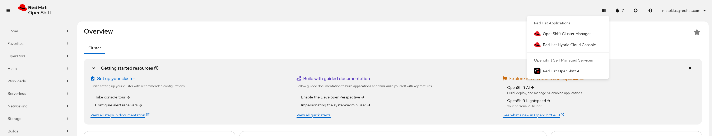
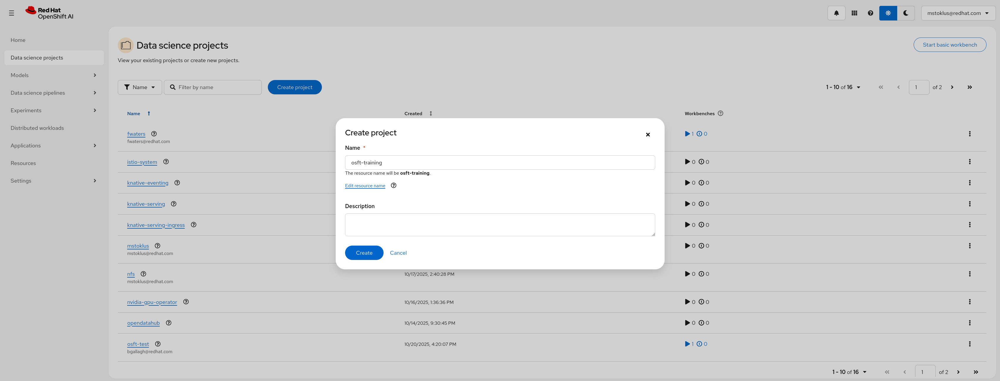
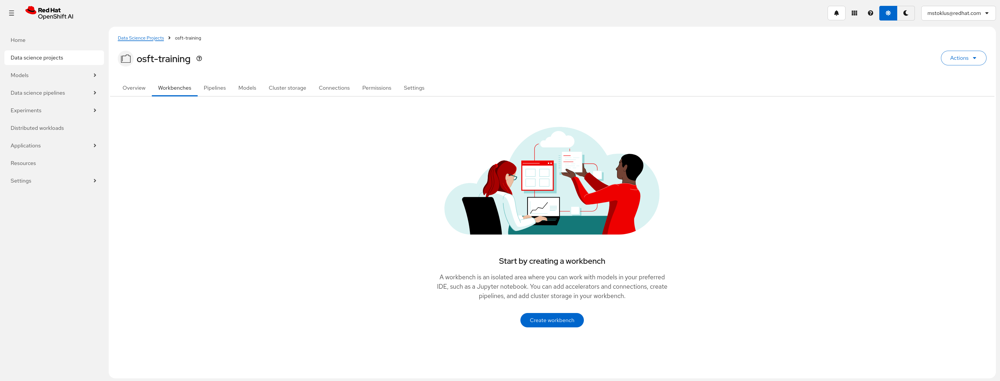
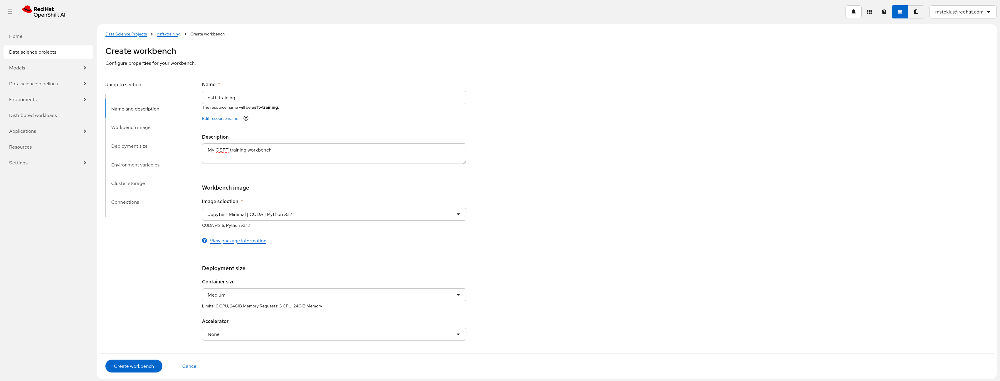
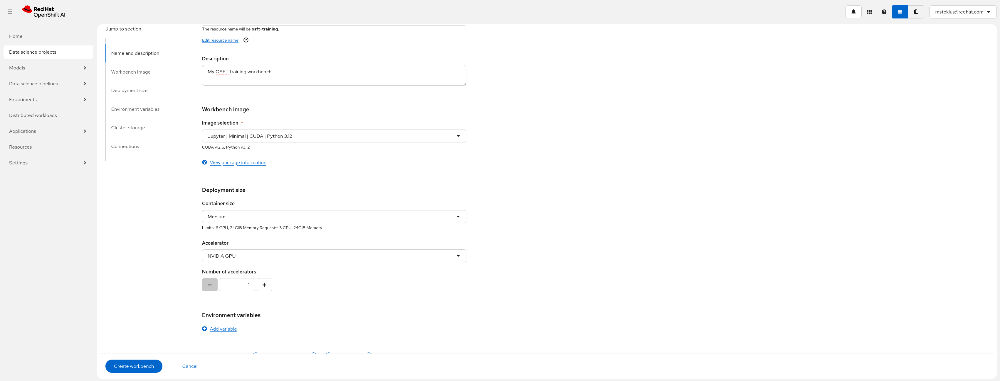
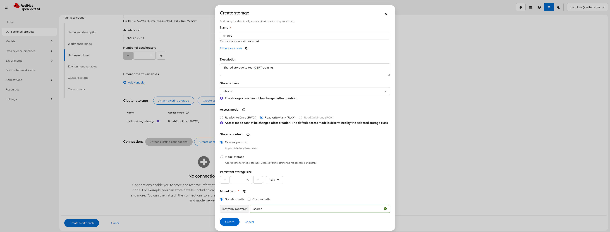
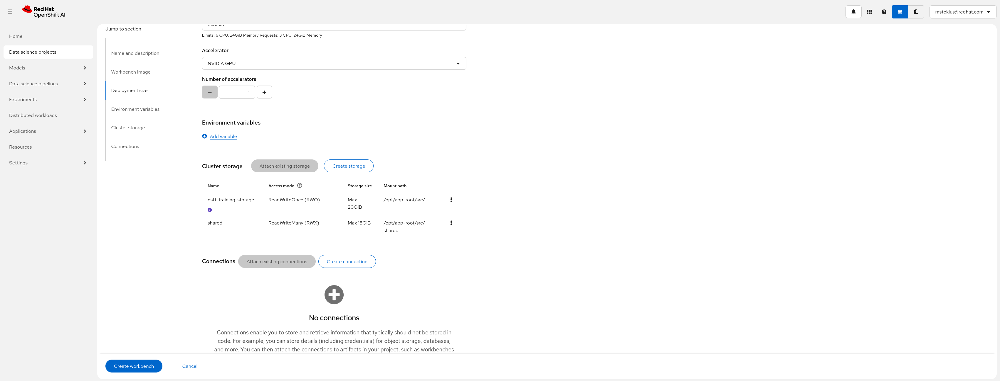
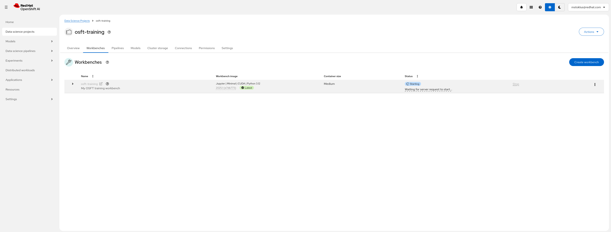

# LoRA/QLoRA Fine-Tuning with Training Hub

This notebook demonstrates how to use Training Hub's LoRA (Low-Rank Adaptation) and QLoRA capabilities for parameter-efficient fine-tuning. We'll train a model to convert natural language questions into SQL queries using the popular [sql-create-context](https://huggingface.co/datasets/b-mc2/sql-create-context) dataset.

## What is LoRA?

LoRA (Low-Rank Adaptation) is a parameter-efficient fine-tuning technique that:
- Freezes the pre-trained model weights
- Injects trainable low-rank matrices into each layer
- Reduces trainable parameters by ~10,000x compared to full fine-tuning
- Enables fine-tuning large models on consumer GPUs

**QLoRA** extends LoRA by adding 4-bit quantization, further reducing memory requirements while maintaining quality.

## Training Task: Natural Language to SQL

We'll train the model to understand database schemas and generate SQL queries from natural language questions. For example:

**Input:**
```
Table: employees (id, name, department, salary)
Question: What is the average salary in the engineering department?
```

**Output:**
```sql
SELECT AVG(salary) FROM employees WHERE department = 'engineering'
```

## Execution modes

LORA/QLORA can run directly in a workbench, where training occurs on a single pod. Alternatively, it supports distributed training across multiple nodes/pods using Kubeflow Trainer. Two notebooks are provided to demonstrate these approaches: `lora_sft-local.ipynb` for single-pod training and `lora_sft-distributed.ipynb` for distributed training. While workbench setup is similar for both, we highlight specific configuration differences below.


## Hardware requirements to run the example notebook

### Workbench Requirements (Local example)

| Image Type | Use Case | GPU | CPU | Memory | Notes |
|------------|----------|-----|-----|--------|-------|
| CUDA PyTorch Python 3.12 | NVIDIA GPU training | 1× GPU | 4 cores | 32Gi | Recommended for faster training |

> [!NOTE]
>
> - Local mode is recommended for smaller training jobs.
> - For larger training jobs consider the distributed training approach.

### Training Job Requirements (Distributed example)

| Component | Configuration | GPU per node | Total GPU | GPU Type (per GPU) | CPU | Memory | Flash Attention |
|-----------|--------------|---|---|------------|-----|--------|-----------------|
| Training Pods | 2 nodes × 2 GPUs | 2 | 4 | NVIDIA L40/L40S or equivalent | 4 cores/pod | 32Gi/pod | Required |
> [!NOTE]
>
> - This example was tested on 2 nodes x 2 GPUs provided by L40S however, it will work on smaller/larger configurations.
> - Flash Attention is required for efficient training.
> - CPU and Memory requirements scale with batch size and model size. Above suit the example as it is.
> - Worker pods are configurable from the `client.create_job` call within the notebook.

### Workbench Requirements (Distributed example)

| Image Type | Use Case | GPU | CPU | Memory | Notes |
|------------|----------|-----|-----|--------|-------|
| Minimal CPU Python 3.12 | CPU-based evaluation | None | 6 cores | 24Gi | Slower evaluation |
| Minimal CUDA Python 3.12 (Example Default) | NVIDIA GPU evaluation (Example Default) | 1× GPU | 2 cores | 8Gi | Recommended for faster testing |

> [!NOTE]
>
> - Workbench GPU is optional but recommended for faster model evaluation
> - Evaluation was performed on L40S GPU however, it will work on smaller/larger configurations.
> - Workbench resources and accelerator are configurable in `Create Workbench` view on RHOAI Platform

### Storage Requirements (Distributed example)

| Purpose | Size | Access Mode | Storage Class | Notes |
|---------|------|-------------|---------------|-------|
| Shared Storage (PVC) total | 10Gi (Example Default) | RWX | Dynamic provisioner required | Shared between workbench and training pods |

> [!NOTE]
>
> - Storage can be created in `Create Workbench` view on RHOAI Platform, however, dynamic RWX provisioner is required to be configured prior to creating shared file storage in RHOAI.
> - Shared storage is not required for the local example as dataset, model download and training all happen on the same pod.
## Setup

### Setup Workbench

- Access the OpenShift AI dashboard, for example from the top navigation bar menu:

- Log in, then go to _Data Science Projects_ and create a project:

- Once the project is created, click on _Create a workbench_:

- Then create a workbench with the following settings:
  - Select the `Jupyter | Minimal | CPU | Python 3.12` notebook image if you want to run CPU based evaluation, `Jupyter | Minimal | CUDA | Python 3.12` for NVIDIA GPUs evaluation and `Medium` container size:
    
  - Add an accelerator if you plan on evaluating your model on GPUs (faster):
    
    > [!NOTE]
    > Adding an accelerator is only needed to test the fine-tuned model from within the workbench so you can spare an accelerator if needed.
  - Create a storage that'll be shared between the workbench and the training pods.
    Make sure it uses a storage class with RWX capability and set it to 15GiB in size:
        
    > [!NOTE]
    > You can attach an existing shared storage if you already have one instead.
  - Review the storage configuration and click "Create workbench":
    
- From "Workbenches" page, click on _Open_ when the workbench you've just created becomes ready:

- From the workbench, clone this repository, i.e., `https://red-hat-data-services/red-hat-ai-examples.git`

- Navigate to the `examples/fine-tuning/osft` directory and open the `osft-example.ipynb` notebook

